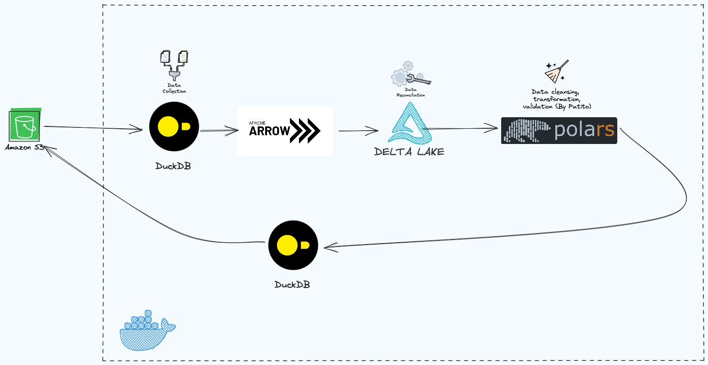

# Polars Analysis

A pipeline to pull data from S3 and process using Polars, Delta-RS and DuckDB

## Update

With the new release of Polars `0.19.x`, I decided to update the ETL pipeline
from `DuckDB - Polars - PyArrow - Deltalake` to solely
`PyArrow - Polars- Deltalake`. Importing and exporting parquet file with `pyarrow.parquet` is to reduce the time
consumption instead of DuckDB.

Two new files were added in `src` folder: `polars-ingestion` and `polars-run`. The old ETL pipeline is renamed
to `duckdb-ingestion` and `duckdb-run`.

## Design

### DuckDB pipeline

In this `duckDB` pipeline, we will use `polars` , `duckdb` and `pyarrow` as main data stack
with the support of `delta-rs` as the table format. We also have **AWS S3** as object storage for our dataset.
The combined data stack can act as the performant option in low-latency ETLs on small to medium-size datasets.

1. Reading the parquet format data from **S3** using `duckdb`.
2. Transforming data to **DeltaTable** using `pyarrow`.
3. Performing `compact` and `z-order` optimization using `delta-rs`.
4. Using `polars` to scan delta table and doing analysis.
5. Writing the result file (in parquet format) back to **S3**

### PyArrow pipeline

This pipeline is pretty similar to `duckdb` pipeline with `pyarrow.parquet` replacing `duckdb` in sections of importing
and exporting parquet file back and forth to **AWS S3**. This improves the runtime of pipeline with *
*_relatively around 20-30 seconds (on my system)_**.

### So why do we use **Delta-RS**, **DuckDB**, **Polars** and **Arrow**

- **Delta-RS** written in Rust and binding to Python provides low-level access to Delta tables which can be used in data
  processing framework.
- **DuckDB** is an open-source in-process SQL OLAP database management system which catches a lot of attention recently.
  DuckDB is designed to run complex SQL queries within other processes.
- Part of **Apache Arrow** is an in-memory data format optimized for analytical process. Together with DuckDB, the
  integration between them can provide zero-copy streaming data to many formats and interchange between various language
  library.
- **Polars** is a highly performant DataFrame library for manipulating structured data. The core is written in Rust, but
  the library is available in Python. Polars comes with a vectorized query engine which is for data processing manner.


## Setup

### Prerequisite

1. [DuckDB](https://duckdb.org/)
2. [Polars](https://www.pola.rs/)
3. [Patito](https://github.com/kolonialno/patito)
3. [Delta-RS](https://github.com/delta-io/delta-rs)
4. [PyArrow](https://arrow.apache.org/docs/index.html)
5. [AWS Account](https://aws.amazon.com/)

This project also uses Python 3.10.10 and using `poetry` as package management.

To run the pipeline, you need to provide a `.env` file (located in the root folder) looking like this:

```
S3_BUCKET=
LOCAL_FILE_PATH=
AWS_DEFAULT_REGION=
AWS_SECRET_ACCESS_KEY=
AWS_ACCESS_KEY_ID=
```

### About dataset

The dataset contains retail data can be downloaded
from [link](https://drive.google.com/file/d/1v9X-GlSDtL1mFFTQadGr0QuBxnmh-wLp/view?usp=drive_link). This file is stored
in
CSV file and in order to transform it to Parquet, you can follow this snippet:

```python
import duckdb

conn = duckdb.connect()
conn.execute(
		"""
        COPY (SELECT * FROM read_csv_auto(
        'link-to-download-file'))
        TO 'data.parquet' (FORMAT 'parquet');
        """
)
```

### Replicate pipeline

To replicate, you can clone this project and run these commands.

```shell
git clone https://github.com/andreale28/Polars-Analysis.git
cd Polars-Analysis
# install poetry
curl -sSL https://install.python-poetry.org | python3 -
# run poetry
poetry install
# run pipeline
python3 -m duckdb_run.py
```

To run Docker container, you can run Dockerfile following these commands.

```shell
docker build . -t polars-analysis
docker run --entrypoint /bin/bash -it polars-analysis
cd script
python -m main
```

## Contributing

Contributions are welcome. If you would like to contribute you can help by opening a Github issue or putting up a PR.
